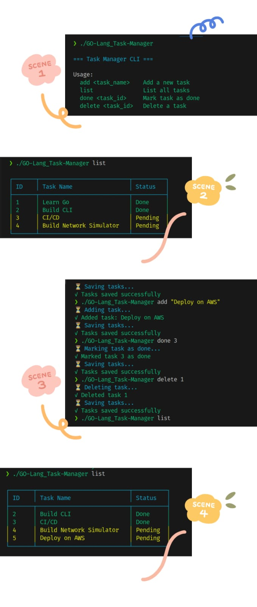

# GO Task Manager

A simple command-line task manager written in Go. Manage your tasks with commands to add, list, mark as done, or delete tasks. Tasks are saved in a JSON file (`tasks.json`).

## Project Structure
GO-Lang_Task-Manager/
├── go.mod
├── main.go
├── README.md
├── tasks/
│   └── tasks.go
└── tasks.json

## Features

- Add tasks with a name
- List all tasks in a formatted table
- Mark tasks as done
- Delete tasks
- Colorful CLI output
- Persistent storage in `tasks.json`

## Requirements

- Go 1.23 or later
- Dependencies: `github.com/fatih/color`

## Installation

1. Clone the repository:
   ```bash
   git clone https://github.com/rohitkshirsagar19/GO-Lang_Task-Manager.git
   cd GO-Lang_Task-Manager
   ```
2. Install dependencies:
    ```bash
    go mod tidy
    ```
3. Build and run:
    ```bash
    go build
    ./GO-Lang_Task-Manager
    ```
## Usage

Run the program with the following commands:
```bash
./GO-Lang_Task-Manager <command> [arguments]
```

## Screenshot

Here’s how the Task Manager CLI looks in action:


